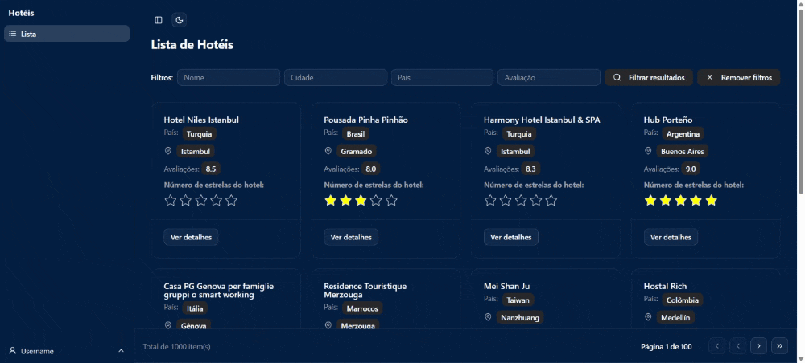
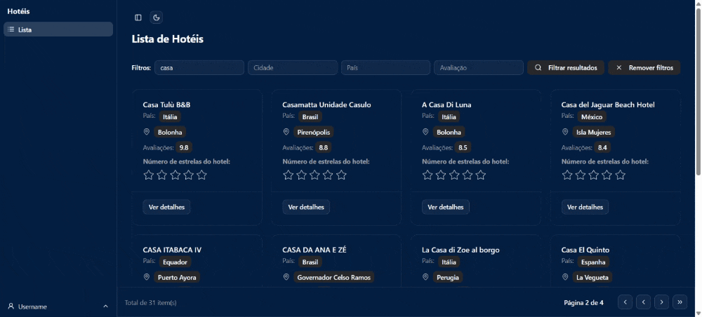

# Teste técnico: desenvolvedor front-end Befly

## React + TypeScript + Vite + Tailwind

## Funcionalidades Obrigatórias

### 1. Página de Login

- Formulário com campos nome de usuário e senha

- Validação de campos obrigatórios

- Tratamento de erros de autenticação

- Redirecionamento automático após login bem sucedido

- Persistência do token JWT para as rotas protegidas

### 2. Página de Listagem de Hotéis

- Lista de hotéis paginada

- Filtros (opcionais):

- Nome do hotel

- Cidade

- País

- Classificação mínima

- Paginação com controles de navegação (limite/offset)

- Cards/lista responsiva com informações principais

- Link para a página de detalhes
- Tenha liberdade para incrementar componentes e recursos que você considera relevantes

### 3. Página de Detalhes do Hotel

- Exibição completa das informações do hotel

- Layout responsivo e bem estruturado

- Botão de voltar para a listagem

- Tenha liberdade para incrementar componentes e recursos que você considera relevantes
  

# Print Screen

|Login|List|Detail|
|-------|------|------|
||||

Link temp:

## ✔️ Lista das bibliotecas utilizadas no desenvolvimento:

- `react`
- `react-dom`
- `react-router-dom`
- `vite`
- `TypeScript`
- `tailwindcss`
- `react-hook-form`
- `@hookform/resolvers`
- `zod`
- `@tanstack/react-query`
- `axios`
- `shadcn`
- `leaflet`
- `react-leaflet`

# 🛠️ Abrir e rodar o projeto

## Requisitos

- Node.js >= 18

Dentro da pasta do projeto execute `npm i` ou `yarn` para instalar as dependências e `npm run dev` ou `yarn dev` para iniciar o projeto.